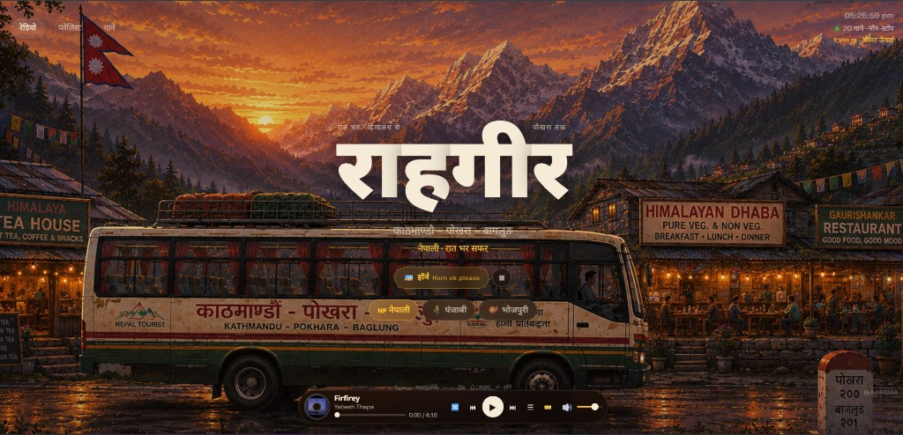
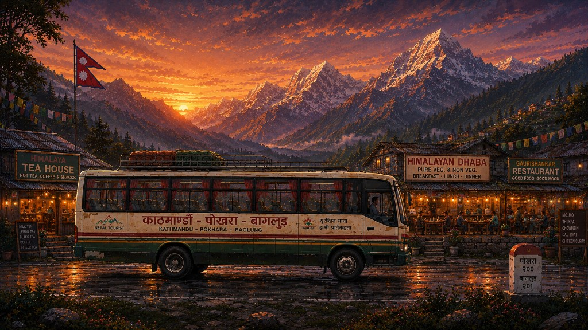

# राहगीर — Nepali, Punjabi & Bhojpuri Music Radio

🌐 **Live Website**: [https://rahgir-beige.vercel.app/](https://rahgir-beige.vercel.app/)

A viral-style music radio website inspired by [busdriver.wtf](https://busdriver.wtf/) and [deluxesalon.in](https://deluxesalon.in/). Sit on a virtual bus seat, pick a culture, and listen all night — from the Himalayas to the Ganges.

## Home — Nepal (default)



## Features

- **राहगीर hero** — each letter (रा · ह · गी · र) dances separately when the horn plays
- **Culture-specific quotes** above the title (Nepali, Punjabi, Bhojpuri)
- **3 cultures**: Nepali (default), Punjabi, Bhojpuri — each with its own route, slideshow & playlist
- **Compact glass player** fixed at the bottom (near the bus wheel) — play, seek, shuffle, volume, queue
- **Horn OK Please** — bus horn over the music with volume ducking + stop button
- **Real-time clock** + Nepal altitude badge under song count
- **Scrollable culture page** — significance, highlights, song info (bus background stays visible)
- **Share ticket** — PNG image + QR code pointing directly to [rahgir-beige.vercel.app](https://rahgir-beige.vercel.app/)
- **Rotating CD** with real album art from YouTube
- **High-performance slideshow** — WebP optimized backgrounds with just-in-time prefetching
- **Vercel Analytics** integrated for tracking visitors and listening metrics
- **No autoplay** — music starts only when you press play
- **Playlists & Songs** pages with Hindi UI labels

## Asset folders

Background art lives under `Asset/`:

| Culture | Web (16:9) | Mobile (9:16) |
|---------|------------|---------------|
| Nepal | `Asset/Nepal/Web/` | `Asset/Nepal/Mobile/` |
| Punjab | `Asset/Punjab/Web/` | `Asset/Punjab/Mobile/` |
| Bihar (Bhojpuri) | `Asset/Bihar/Web/` | `Asset/Bihar/Mobile/` |

Example Nepal scenery:



Horn sounds: `Asset/Horn Sound/*.mp3`

## Quick start

```bash
npm install
npm run dev
```

Open http://localhost:5173

## Update playlists

Requires [yt-dlp](https://github.com/yt-dlp/yt-dlp):

```bash
npm run fetch-playlists
```

## Deploy

```bash
npm run build
```

Upload the `dist/` folder to static hosts (Vercel, Netlify, Cloudflare Pages, etc.).

## Keyboard shortcuts

| Key | Action |
|-----|--------|
| Space | Play / Pause |
| ← → | Prev / Next track |
| N / P | Next / Prev track |
| Q | Queue |
| T | Ticket (share PNG) |
| H | Horn |

## Share ticket

Press **T** or tap the ticket button. **Share** exports a PNG of your ticket (route, seat, song, QR). On mobile it uses the native share sheet with the image; on desktop it downloads the PNG and copies the link (`https://rahgir-beige.vercel.app`).

## Playlists

- Nepali: [YouTube Music](https://music.youtube.com/playlist?list=PLETcP_FdLOGY)
- Punjabi: [YouTube Music](https://music.youtube.com/playlist?list=PLKGdFvuCgQRQ)
- Bhojpuri: [YouTube Music](https://music.youtube.com/playlist?list=PLVTwrTzYCvPU)

## Contact

Made with ❤️ by **[Aditya Kumar](https://github.com/Adi51244)** ([@Adi51244](https://github.com/Adi51244)) — kumarsinghu0@gmail.com

Repository: [github.com/Adi51244/Rahgir](https://github.com/Adi51244/Rahgir)

Audio plays via YouTube's embedded player. Rights remain with labels, composers and performers.
